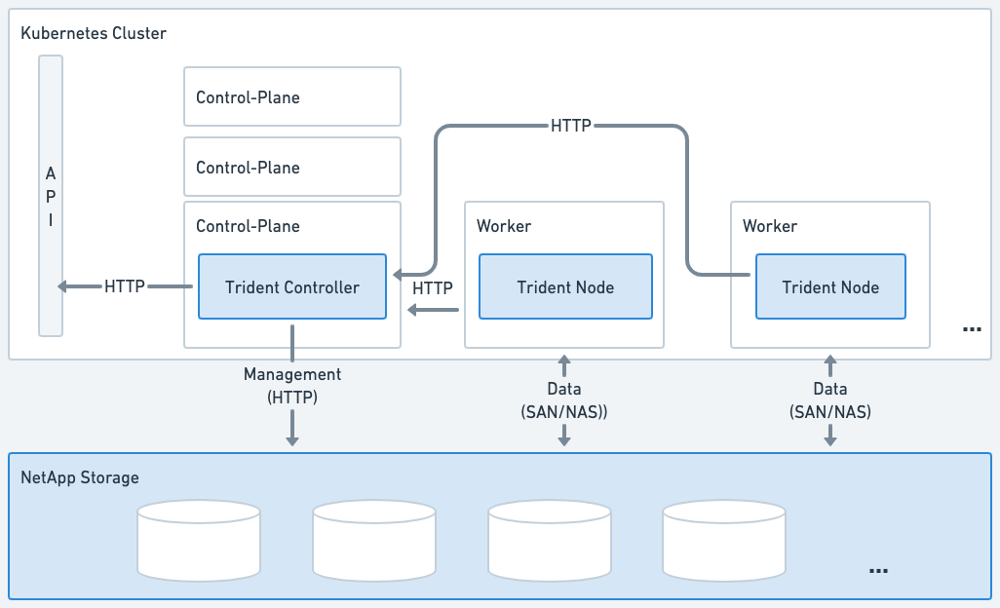

= Arquitectura de Trident
:hardbreaks:
:allow-uri-read: 
:icons: font
:imagesdir: ../media/

[role="lead"]
Trident se ejecuta como un pod de controladora más un pod de nodo en cada nodo trabajador del clúster. El pod de nodo debe ejecutarse en cualquier host en el que desee potencialmente montar un volumen de Trident.

== Descripción de los pods de la controladora y los pods de nodo

Trident se pone en marcha como <<Pod de controladora de Trident>>uno o más <<Pods de nodos de Trident>> en el clúster de Kubernetes y utiliza contenedores Sidecar Containers_ estándar de Kubernetes _CSI para simplificar la implementación de los complementos CSI. link:https://kubernetes-csi.github.io/docs/sidecar-containers.html["Contenedores Sidecar de Kubernetes CSI"^] Los mantiene la comunidad de Kubernetes Storage.

Kubernetes link:https://kubernetes.io/docs/concepts/scheduling-eviction/assign-pod-node/["selectores de nodos"^] y link:https://kubernetes.io/docs/concepts/scheduling-eviction/taint-and-toleration/["toleraciones y tintes"^] se utilizan para restringir que un pod se ejecute en un nodo específico o preferido. Durante la instalación de Trident, se pueden configurar selectores de nodos y toleraciones para pods de nodos y controladoras.

* El complemento de la controladora se ocupa del aprovisionamiento y la gestión de volúmenes, como snapshots y redimensionamiento.
* El complemento de nodo se encarga de conectar el almacenamiento al nodo.

.Trident puesto en marcha en el clúster de Kubernetes

=== Pod de controladora de Trident

Trident Controller Pod es un pod único que ejecuta el complemento CSI Controller.

* Responsable de aprovisionar y gestionar volúmenes en el almacenamiento de NetApp
* Gestionado por una puesta en marcha de Kubernetes
* Se puede ejecutar en el plano de control o en los nodos de trabajo, según los parámetros de instalación.

.Diagrama de Trident Controller Pod
image::../media/controller-pod.png[Diagrama del Trident Controller Pod que ejecuta el complemento CSI Controller con sidecars CSI aplicables.]

=== Pods de nodos de Trident

Los pods de nodos Trident son pods con privilegios que ejecutan el plugin de nodo CSI.

* Responsable del montaje y desmontaje del almacenamiento de los pods que se ejecutan en el host
* Gestionado por un DaemonSet de Kubernetes
* Debe ejecutarse en cualquier nodo que monte el almacenamiento de NetApp

.Diagrama de Trident Node Pod
image::../media/node-pod.png[Diagrama del Trident Node Pod que ejecuta el complemento CSI Node con el sidecar CSI correspondiente.]

== Arquitecturas de clúster de Kubernetes compatibles

Trident es compatible con las siguientes arquitecturas de Kubernetes:

[cols="3,1,2"]
|===
| Arquitecturas de clústeres de Kubernetes | Compatible | Instalación predeterminada 

| Un único maestro, informática | Sí  a| 
Sí

| Varios maestros, informáticos | Sí  a| 
Sí

| Maestro, `etcd`, cálculo | Sí  a| 
Sí

| Maestro, infraestructura y computación | Sí  a| 
Sí

|===