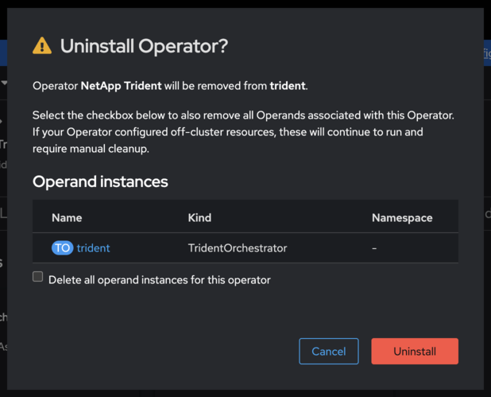

= Cambie de operador comunitario Trident a operador certificado OpenShift
:hardbreaks:
:allow-uri-read: 
:icons: font
:imagesdir: ../media/

[role="lead"]
Para pasar del Operador de Trident de la Comunidad de NetApp al Operador de Trident Certificado de Red Hat OpenShift, deberá desinstalar el Operador de la Comunidad e instalar el Operador certificado mediante el Centro de operadores.

.Antes de empezar
Antes de comenzar la instalación, link:../trident-get-started/requirements.html["Preparar el entorno para la instalación de Trident"].

== Desinstale el operador de la comunidad NetApp Trident

.Pasos
. Utilice la consola de OpenShift para navegar hasta OperatorHub.
+
image::../media/openshift-operator-05.png[Instale]

. Busque al operador de la comunidad NetApp Trident.
+

+

WARNING: No seleccione *Eliminar todas las instancias de operando de este operador*.

. Haga clic en *Desinstalar*.

== Instale el operador certificado de OpenShift

.Pasos
. Vaya a Red Hat OperatorHub.
. Busque y seleccione el operador de NetApp Trident.
+
image::../media/openshift-operator-05.png[Instale]

. Siga las instrucciones que aparecen en pantalla para instalar el operador.

== Verificación

* Compruebe el OperatorHub en la consola para asegurarse de que el nuevo operador certificado se ha instalado correctamente.

