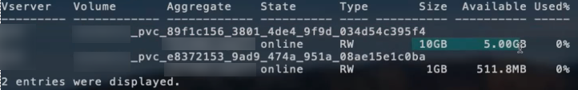

= Opciones y ejemplos de configuración NAS de ONTAP
:hardbreaks:
:allow-uri-read: 
:icons: font
:imagesdir: ../media/

[role="lead"]
Crea y utiliza controladores NAS de ONTAP con tu instalación de Trident. Esta sección ofrece ejemplos de configuración de backends y detalles para asignar backends a StorageClasses. A partir de la versión 25.10, NetApp Trident es compatible con link:https://docs.netapp.com/us-en/ontap-afx/index.html["Sistemas de almacenamiento NetApp AFX"^]. NetApp AFX los sistemas de almacenamiento se diferencian de otros sistemas basados en ONTAP (ASA, AFF y FAS) en la implementación de su capa de almacenamiento.

NOTE: Solo el `ontap-nas` El controlador (con protocolo NFS) es compatible con los sistemas NetApp AFX; el protocolo SMB no es compatible.

[[backend-configuration-options]]
== Opciones de configuración del back-end

En la configuración del backend de Trident, no necesitas especificar que tu sistema es un sistema de almacenamiento AFX de NetApp. Cuando seleccionas `ontap-nas` como `storageDriverName`, Trident detecta automáticamente el sistema de almacenamiento AFX. Algunos parámetros de configuración del backend no aplican a los sistemas de almacenamiento AFX.

A partir de la versión 26.06, puedes habilitar la distribución equilibrada de ONTAP para que ONTAP seleccione el agregado para los nuevos volúmenes. La distribución equilibrada es obligatoria para los sistemas de almacenamiento AFX con ONTAP 9.19.1 o posterior. Consulta link:ontap-balanced-placement.html["Utiliza la distribución equilibrada con los backends de ONTAP"] para requisitos y ejemplos.

La siguiente tabla muestra las opciones de configuración del backend:

[cols="1,3,2"]
|===
| Parámetro | Descripción | Predeterminado 

| `version` |  | Siempre 1 

| `storageDriverName`  a| 
Nombre del controlador de almacenamiento.

No se puede modificar una vez creado. Para actualizar este parámetro, debes crear un nuevo backend.

NOTE: Para sistemas NetApp AFX, solo `ontap-nas` está soportado.
| `ontap-nas`, , `ontap-nas-economy` o. `ontap-nas-flexgroup` 

| `backendName` | Nombre personalizado o el back-end de almacenamiento | Nombre de controlador + «_» + LIF de datos 

| `managementLIF` | Dirección IP de un clúster o una LIF de gestión de SVM Se puede especificar un nombre de dominio completo (FQDN). Se puede configurar para utilizar direcciones IPv6 si Trident se instaló con el indicador IPv6. Las direcciones IPv6 deben definirse entre corchetes, `[28e8:d9fb:a825:b7bf:69a8:d02f:9e7b:3555]` como . Para una conmutación de sitios MetroCluster fluida, consulte <<mcc-best>>. | «10,0.0,1», «[2001:1234:abcd::fefe]» 

| `dataLIF` | Dirección IP de LIF de protocolo. NetApp recomienda especificar `dataLIF`. Si no se proporciona, Trident recupera las LIF de datos de la SVM. Puede especificar un nombre de dominio completo (FQDN) que se utilice para las operaciones de montaje de NFS, lo que permite crear un DNS por turnos para equilibrar la carga en varias LIF de datos. Se puede cambiar después del ajuste inicial. Consulte . Se puede configurar para utilizar direcciones IPv6 si Trident se instaló con el indicador IPv6. Las direcciones IPv6 deben definirse entre corchetes, `[28e8:d9fb:a825:b7bf:69a8:d02f:9e7b:3555]` como . *Omitir para MetroCluster.* Consulte la <<mcc-best>>. | Dirección especificada o derivada de la SVM, si no se especifica (no recomendada) 

| `svm` | Máquina virtual de almacenamiento que usar

*Omitir para MetroCluster.* Ver <<mcc-best>>. | Derivado si una SVM `managementLIF` está especificado 

| `autoExportPolicy` | Habilite la creación y actualización automática de la política de exportación [Boolean]. Mediante las `autoExportPolicy` opciones y `autoExportCIDRs`, Trident puede gestionar automáticamente las políticas de exportación. | falso 

| `autoExportCIDRs` | Lista de CIDRs para filtrar las IP del nodo de Kubernetes contra cuando `autoExportPolicy` se habilita. Mediante las `autoExportPolicy` opciones y `autoExportCIDRs`, Trident puede gestionar automáticamente las políticas de exportación. | [«0,0.0,0/0», «:/0»] 

| `labels` | Conjunto de etiquetas con formato JSON arbitrario que se aplica en los volúmenes | "" 

| `clientCertificate` | Valor codificado en base64 del certificado de cliente. Se utiliza para autenticación basada en certificados | "" 

| `clientPrivateKey` | Valor codificado en base64 de la clave privada de cliente. Se utiliza para autenticación basada en certificados | "" 

| `trustedCACertificate` | Valor codificado en base64 del certificado de CA de confianza. Opcional. Se utiliza para autenticación basada en certificados | "" 

| `username` | Nombre de usuario para conectarse al clúster/SVM. Se utiliza para la autenticación basada en credenciales. Para la autenticación de Active Directory, consulte link:../trident-use/ontap-san-examples.html#authenticate-trident-to-a-backend-svm-using-active-directory-credentials["Autenticar Trident en un SVM backend mediante credenciales de Active Directory"]. |  

| `password` | Contraseña para conectarse al cluster/SVM. Se utiliza para la autenticación basada en credenciales. Para la autenticación de Active Directory, consulte link:../trident-use/ontap-san-examples.html#authenticate-trident-to-a-backend-svm-using-active-directory-credentials["Autenticar Trident en un SVM backend mediante credenciales de Active Directory"]. |  

| `storagePrefix`  a| 
El prefijo que se utiliza cuando se aprovisionan volúmenes nuevos en la SVM. No se puede actualizar después de configurarlo

NOTE: Cuando usas ontap-nas-economy y un storagePrefix que tiene 24 caracteres o más, los qtrees no tienen el prefijo de almacenamiento incluido, aunque sí aparece en el nombre del volumen.
| «trident» 

| `aggregate`  a| 
Agregado para el aprovisionamiento (opcional; si se configura, debe asignarse al SVM). Para el `ontap-nas-flexgroup` driver, esta opción se ignora. Si no se asigna, se puede utilizar cualquiera de los agregados disponibles para aprovisionar un volumen FlexGroup.

NOTE: Cuando se actualiza el agregado en SVM, se actualiza automáticamente en Trident mediante el sondeo de SVM sin necesidad de reiniciar el controlador de Trident. Cuando has configurado un agregado específico en Trident para aprovisionar volúmenes, si el agregado se renombra o se traslada fuera del SVM, el backend pasa al estado de fallo en Trident durante el sondeo del agregado de SVM. Debes cambiar el agregado por uno que esté presente en el SVM o eliminarlo por completo para que el backend vuelva a estar en línea.

*No especificar para sistemas de almacenamiento AFX.*

*No especifiques cuándo  `useBalancedPlacement` está configurado como  `true`.*
 a| 
""

| `useBalancedPlacement`  a| 
Delegar la selección de agregados para nuevos volúmenes a ONTAP [booleano]. Requiere ONTAP 9.19.1 o posterior y  `useREST` configurado en  `true`. No se puede combinar con  `aggregate`.

Consulta link:ontap-balanced-placement.html["Utiliza la distribución equilibrada con los backends de ONTAP"] para conocer los requisitos y ver ejemplos.

*Si se especifica, configúralo siempre como  `true` para los sistemas de almacenamiento AFX con ONTAP 9.19.1 o posterior.*
| `false`; `true` para sistemas de almacenamiento AFX con ONTAP 9.19.1 o posterior 

| `limitAggregateUsage` | Fallará el aprovisionamiento si el uso supera este porcentaje. *No se aplica a Amazon FSx para ONTAP*. *No especificar para sistemas de almacenamiento AFX.* | "" (no se aplica de forma predeterminada) 

| Lista de Agregados de Flexgroup  a| 
Lista de agregados para el aprovisionamiento (opcional; si se ha definido, debe asignarse a la SVM). Todos los agregados asignados a la SVM se usan para aprovisionar un volumen FlexGroup. Compatible con el controlador de almacenamiento *ONTAP-nas-FlexGroup*.

NOTE: Cuando se actualiza la lista de agregados en SVM, la lista se actualiza automáticamente en Trident mediante la consulta a SVM sin tener que reiniciar el controlador de Trident. Cuando has configurado una lista de agregados específica en Trident para aprovisionar volúmenes, si la lista de agregados se renombra o se mueve fuera de SVM, el backend pasa a estado de fallo en Trident mientras consulta el agregado de SVM. Debes cambiar la lista de agregados por una que esté presente en SVM o eliminarla por completo para que el backend vuelva a estar en línea.
| "" 

| `limitVolumeSize` | Fallará el aprovisionamiento si el tamaño de volumen solicitado supera este valor. | '' (no se aplica por defecto) 

| `debugTraceFlags` | Indicadores de depuración que se deben usar para la solución de problemas. Ejemplo, {«api»:false, «method»:true}

No utilizar `debugTraceFlags` a menos que esté solucionando problemas y necesite un volcado de registro detallado. | nulo 

| `nasType` | Configure la creación de volúmenes NFS o SMB. Las opciones son `nfs` , `smb` o nulo. Si se establece en nulo, se utilizarán volúmenes NFS por defecto. *Si se especifica, siempre se establecerá en `nfs` para sistemas de almacenamiento AFX*. | `nfs` 

| `nfsMountOptions` | Lista separada por comas de opciones de montaje NFS. Las opciones de montaje para los volúmenes persistentes de Kubernetes normalmente se especifican en las clases de almacenamiento, pero si no se especifican opciones de montaje en una clase de almacenamiento, Trident recurre a las opciones de montaje especificadas en el archivo de configuración del backend de almacenamiento. Si no se especifican opciones de montaje ni en la clase de almacenamiento ni en el archivo de configuración, Trident no establece ninguna opción de montaje en un volumen persistente asociado. | "" 

| `qtreesPerFlexvol` | El número máximo de qtrees por FlexVol debe estar comprendido entre [50, 300] | «200» 

| `smbShare` | Puede especificar una de las siguientes opciones: El nombre de un recurso compartido de SMB creado mediante la consola de administración de Microsoft o la interfaz de línea de comandos de ONTAP; un nombre para permitir que Trident cree el recurso compartido de SMB; o bien puede dejar el parámetro en blanco para evitar el acceso de recurso compartido común a los volúmenes. Este parámetro es opcional para ONTAP en las instalaciones. Este parámetro es necesario para los back-ends de Amazon FSx para ONTAP y no puede estar en blanco. | `smb-share` 

| `useREST` | Parámetro booleano para utilizar las API REST de ONTAP .  `useREST`Cuando se configura para `true` Trident utiliza las API REST de ONTAP para comunicarse con el backend; cuando se configura en `false` Trident utiliza llamadas ONTAPI (ZAPI) para comunicarse con el backend. Esta función requiere ONTAP 9.11.1 y versiones posteriores. Además, el rol de inicio de sesión de ONTAP utilizado debe tener acceso a `ontapi` solicitud. Esto se satisface mediante lo predefinido. `vsadmin` y `cluster-admin` roles. A partir de la versión Trident 24.06 y ONTAP 9.15.1 o posterior, `useREST` está configurado para `true` por defecto; cambiar `useREST` a `false` para utilizar llamadas ONTAPI (ZAPI). *Si se especifica, siempre se establecerá en `true` para sistemas de almacenamiento AFX*. | `true` Para ONTAP 9.15.1 o posterior, de lo contrario `false`. 

| `limitVolumePoolSize` | Tamaño máximo de FlexVol que se puede solicitar cuando se utilizan qtrees en el back-end económico de ONTAP-nas. | "" (no se aplica de forma predeterminada) 

| `denyNewVolumePools` | Restringe `ontap-nas-economy` los back-ends de la creación de nuevos volúmenes de FlexVol para contener sus Qtrees. Solo se utilizan los FlexVols preexistentes para aprovisionar nuevos VP. |  

| `adAdminUser` | Usuario o grupo de usuarios administradores de Active Directory con acceso total a los recursos compartidos SMB. Utilice este parámetro para otorgar derechos de administrador al recurso compartido SMB con control total. |  
|===

[[backend-configuration-options-for-provisioning-volumes]]
== Opciones de configuración de back-end para el aprovisionamiento de volúmenes

Puede controlar el aprovisionamiento predeterminado utilizando estas opciones en la `defaults` sección de la configuración. Para ver un ejemplo, vea los ejemplos de configuración siguientes.

[cols="1,3,2"]
|===
| Parámetro | Descripción | Predeterminado 

| `spaceAllocation` | Asignación de espacio para Qtrees | verdadero 

| `spaceReserve` | Modo de reserva de espacio; «ninguno» (fino) o «volumen» (grueso) | ninguno 

| `snapshotPolicy` | Política de Snapshot que se debe usar | ninguno 

| `qosPolicy` | Grupo de políticas de calidad de servicio que se asignará a los volúmenes creados. Elija uno de qosPolicy o adaptiveQosPolicy por pool/back-end de almacenamiento | "" 

| `adaptiveQosPolicy` | Grupo de políticas de calidad de servicio adaptativo que permite asignar los volúmenes creados. Elija uno de qosPolicy o adaptiveQosPolicy por pool/back-end de almacenamiento. no admitido por ontap-nas-Economy. | "" 

| `snapshotReserve` | Porcentaje de volumen reservado para las Snapshot | «0» si `snapshotPolicy` no es “ninguno”, de lo contrario” 

| `splitOnClone` | Divida un clon de su elemento principal al crearlo | "falso" 

| `encryption` | Activa NetApp Volume Encryption (NVE) en el nuevo volumen; el valor predeterminado es  `false`. NVE debe estar licenciado y habilitado en el clúster para usar esta opción. Si NAE está habilitado en el backend, cualquier volumen aprovisionado en Trident tendrá NAE habilitado. Para más información, consulta: link:../trident-reco/security-reco.html["Cómo funciona Trident con NVE y NAE"]. | "falso" 

| `tieringPolicy` | Política de organización en niveles para utilizar ninguna |  

| `unixPermissions` | Modo para volúmenes nuevos | «777» para volúmenes NFS; vacío (no aplicable) para volúmenes SMB 

| `snapshotDir` | Controla el acceso al `.snapshot` directorio | `true`, `false` (establecer explícitamente). 

| `exportPolicy` | Política de exportación que se va a utilizar | "predeterminado" 

| `securityStyle` | Estilo de seguridad para nuevos volúmenes. Compatibilidad con NFS `mixed` y.. `unix` estilos de seguridad. SMB admite `mixed` y.. `ntfs` estilos de seguridad. | El valor predeterminado de NFS es `unix`. La opción predeterminada de SMB es `ntfs`. 

| `nameTemplate` | Plantilla para crear nombres de volúmenes personalizados. | "" 
|===

NOTE: Usar grupos de políticas de QoS con Trident requiere ONTAP 9 Intersight 8 o posterior. Debe usar un grupo de políticas de calidad de servicio no compartido y asegurarse de que el grupo de políticas se aplique a cada componente individualmente. Un grupo de políticas de calidad de servicio compartido aplica el techo máximo para el rendimiento total de todas las cargas de trabajo.

[[volume-provisioning-examples]]
=== Ejemplos de aprovisionamiento de volúmenes

Aquí hay un ejemplo con los valores predeterminados definidos:

[source, yaml]
----
---
version: 1
storageDriverName: ontap-nas
backendName: customBackendName
managementLIF: 10.0.0.1
dataLIF: 10.0.0.2
labels:
  k8scluster: dev1
  backend: dev1-nasbackend
svm: trident_svm
username: cluster-admin
password: <password>
limitAggregateUsage: 80%
limitVolumeSize: 50Gi
nfsMountOptions: nfsvers=4
debugTraceFlags:
  api: false
  method: true
defaults:
  spaceReserve: volume
  qosPolicy: premium
  exportPolicy: myk8scluster
  snapshotPolicy: default
  snapshotReserve: "10"
----
Para `ontap-nas` y `ontap-nas-flexgroups` Trident ahora utiliza un nuevo cálculo para garantizar que el FlexVol tenga el tamaño correcto con el porcentaje de snapshotReserve y el PVC. Cuando el usuario solicita un PVC, Trident crea el FlexVol original con más espacio mediante el nuevo cálculo. Este cálculo garantiza que el usuario reciba el espacio de escritura que solicitó en el PVC, y no menos espacio del que solicitó. Antes de la versión v21.07, cuando el usuario solicitaba un PVC (por ejemplo, 5 GiB), con el snapshotReserve al 50 %, obtenía solo 2,5 GiB de espacio de escritura. Esto se debe a que lo que el usuario solicitó fue el volumen completo y `snapshotReserve` es un porcentaje de eso. Con Trident 21.07, lo que el usuario solicita es el espacio de escritura y Trident define el `snapshotReserve` número como porcentaje del volumen total. Esto no se aplica a `ontap-nas-economy` . Vea el siguiente ejemplo para ver cómo funciona

El cálculo es el siguiente:

[listing]
----
Total volume size = <PVC requested size> / (1 - (<snapshotReserve percentage> / 100))
----
Para snapshotReserve = 50% y la solicitud de PVC = 5 GiB, el tamaño total del volumen es 5/.5 = 10 GiB y el tamaño disponible es 5 GiB, que es lo que el usuario solicitó en la solicitud de PVC .  `volume show` El comando debería mostrar resultados similares a este ejemplo:

En el caso de los backends existentes de instalaciones anteriores, configura los volúmenes tal y como se explica más arriba al actualizar Trident. Para los volúmenes que creaste antes de la actualización, deberías ajustar su tamaño para que el cambio se vea reflejado. Por ejemplo, un PVC de 2 GiB con `snapshotReserve=50` antes daba como resultado un volumen que proporciona 1 GiB de espacio grabable. Al cambiar el tamaño del volumen a 3 GiB, por ejemplo, la aplicación obtiene 3 GiB de espacio grabable en un volumen de 6 GiB.

[[minimal-configuration-examples]]
== Ejemplos de configuración mínima

Los ejemplos siguientes muestran configuraciones básicas que dejan la mayoría de los parámetros en los valores predeterminados. Esta es la forma más sencilla de definir un back-end.

NOTE: Si utiliza Amazon FSX en ONTAP de NetApp con Trident, la recomendación es especificar nombres DNS para las LIF en lugar de direcciones IP.

.Ejemplo de economía NAS de ONTAP
[%collapsible]
====
[source, yaml]
----
---
version: 1
storageDriverName: ontap-nas-economy
managementLIF: 10.0.0.1
dataLIF: 10.0.0.2
svm: svm_nfs
username: vsadmin
password: password
----
====
.Ejemplo de FlexGroup NAS de ONTAP
[%collapsible]
====
[source, yaml]
----
---
version: 1
storageDriverName: ontap-nas-flexgroup
managementLIF: 10.0.0.1
dataLIF: 10.0.0.2
svm: svm_nfs
username: vsadmin
password: password
----
====
.Ejemplo de MetroCluster
[#mcc-best%collapsible]
====
Puede configurar el backend para evitar tener que actualizar manualmente la definición de backend después del switchover y el switchover durante link:../trident-reco/backup.html#svm-replication-and-recovery["Replicación y recuperación de SVM"].

Para obtener una conmutación de sitios y una conmutación de estado sin problemas, especifique la SVM con `managementLIF` y omita la `dataLIF` y.. `svm` parámetros. Por ejemplo:

[source, yaml]
----
---
version: 1
storageDriverName: ontap-nas
managementLIF: 192.168.1.66
username: vsadmin
password: password
----
====
.Ejemplo de volúmenes de SMB
[%collapsible]
====
[source, yaml]
----
---
version: 1
backendName: ExampleBackend
storageDriverName: ontap-nas
managementLIF: 10.0.0.1
nasType: smb
securityStyle: ntfs
unixPermissions: ""
dataLIF: 10.0.0.2
svm: svm_nfs
username: vsadmin
password: password
----
====
.Ejemplo de autenticación basada en certificados
[%collapsible]
====
Este es un ejemplo de configuración de backend mínima. `clientCertificate`, `clientPrivateKey`, y. `trustedCACertificate` (Opcional, si se utiliza una CA de confianza) se completan en `backend.json` Y tome los valores codificados base64 del certificado de cliente, la clave privada y el certificado de CA de confianza, respectivamente.

[source, yaml]
----
---
version: 1
backendName: DefaultNASBackend
storageDriverName: ontap-nas
managementLIF: 10.0.0.1
dataLIF: 10.0.0.15
svm: nfs_svm
clientCertificate: ZXR0ZXJwYXB...ICMgJ3BhcGVyc2
clientPrivateKey: vciwKIyAgZG...0cnksIGRlc2NyaX
trustedCACertificate: zcyBbaG...b3Igb3duIGNsYXNz
storagePrefix: myPrefix_
----
====
.Ejemplo de política de exportación automática
[%collapsible]
====
En este ejemplo, se muestra cómo puede indicar a Trident que utilice políticas de exportación dinámicas para crear y gestionar la política de exportación automáticamente. Esto funciona igual para `ontap-nas-economy` los controladores y. `ontap-nas-flexgroup`

[source, yaml]
----
---
version: 1
storageDriverName: ontap-nas
managementLIF: 10.0.0.1
dataLIF: 10.0.0.2
svm: svm_nfs
labels:
  k8scluster: test-cluster-east-1a
  backend: test1-nasbackend
autoExportPolicy: true
autoExportCIDRs:
- 10.0.0.0/24
username: admin
password: password
nfsMountOptions: nfsvers=4
----
====
.Ejemplo de distribución equilibrada
[%collapsible]
====
Este ejemplo habilita la distribución equilibrada de ONTAP para que ONTAP seleccione el agregado para los nuevos volúmenes. La distribución equilibrada requiere ONTAP 9.19.1 o una versión posterior. Consulta link:ontap-balanced-placement.html["Utiliza la distribución equilibrada con los backends de ONTAP"] para obtener más información.

[source, yaml]
----
---
version: 1
storageDriverName: ontap-nas
backendName: nas-balanced-placement
managementLIF: 10.0.0.1
dataLIF: 10.0.0.2
svm: svm_nfs
username: vsadmin
password: password
useBalancedPlacement: true
----
====
.Ejemplo de direcciones IPv6
[%collapsible]
====
Este ejemplo muestra `managementLIF` Uso de una dirección IPv6.

[source, yaml]
----
---
version: 1
storageDriverName: ontap-nas
backendName: nas_ipv6_backend
managementLIF: "[5c5d:5edf:8f:7657:bef8:109b:1b41:d491]"
labels:
  k8scluster: test-cluster-east-1a
  backend: test1-ontap-ipv6
svm: nas_ipv6_svm
username: vsadmin
password: password
----
====
.Ejemplo de Amazon FSx para ONTAP mediante volúmenes de bloque de mensajes del servidor
[%collapsible]
====
La `smbShare` El parámetro es obligatorio para FSx para ONTAP mediante volúmenes de bloque de mensajes del servidor.

[source, yaml]
----
---
version: 1
backendName: SMBBackend
storageDriverName: ontap-nas
managementLIF: example.mgmt.fqdn.aws.com
nasType: smb
dataLIF: 10.0.0.15
svm: nfs_svm
smbShare: smb-share
clientCertificate: ZXR0ZXJwYXB...ICMgJ3BhcGVyc2
clientPrivateKey: vciwKIyAgZG...0cnksIGRlc2NyaX
trustedCACertificate: zcyBbaG...b3Igb3duIGNsYXNz
storagePrefix: myPrefix_
----
====
.Ejemplo de configuración de backend con nameTemplate
[%collapsible]
====
[source, yaml]
----
---
version: 1
storageDriverName: ontap-nas
backendName: ontap-nas-backend
managementLIF: <ip address>
svm: svm0
username: <admin>
password: <password>
defaults:
  nameTemplate: "{{.volume.Name}}_{{.labels.cluster}}_{{.volume.Namespace}}_{{.vo\
    lume.RequestName}}"
labels:
  cluster: ClusterA
  PVC: "{{.volume.Namespace}}_{{.volume.RequestName}}"
----
====

[[examples-of-backends-with-virtual-pools]]
== Ejemplos de back-ends con pools virtuales

En los archivos de definición de backend de ejemplo que se muestran a continuación, se establecen valores predeterminados específicos para todos los pools de almacenamiento, como `spaceReserve` en ninguno, `spaceAllocation` en falso, y. `encryption` en falso. Los pools virtuales se definen en la sección de almacenamiento.

Trident establece las etiquetas de aprovisionamiento en el campo de comentarios. Los comentarios se establecen en FlexVol for `ontap-nas` o FlexGroup para `ontap-nas-flexgroup`. Trident copia todas las etiquetas presentes en un pool virtual en el volumen de almacenamiento durante el aprovisionamiento. Para mayor comodidad, los administradores de almacenamiento pueden definir etiquetas por pool virtual y agrupar volúmenes por etiqueta.

En estos ejemplos, algunos de los pools de almacenamiento establecen sus propios `spaceReserve`, `spaceAllocation`, y. `encryption` y algunos pools sustituyen los valores predeterminados.

.Ejemplo de NAS de ONTAP
[%collapsible%open]
====
[source, yaml]
----
---
version: 1
storageDriverName: ontap-nas
managementLIF: 10.0.0.1
svm: svm_nfs
username: admin
password: <password>
nfsMountOptions: nfsvers=4
defaults:
  spaceReserve: none
  encryption: "false"
  qosPolicy: standard
labels:
  store: nas_store
  k8scluster: prod-cluster-1
region: us_east_1
storage:
  - labels:
      app: msoffice
      cost: "100"
    zone: us_east_1a
    defaults:
      spaceReserve: volume
      encryption: "true"
      unixPermissions: "0755"
      adaptiveQosPolicy: adaptive-premium
  - labels:
      app: slack
      cost: "75"
    zone: us_east_1b
    defaults:
      spaceReserve: none
      encryption: "true"
      unixPermissions: "0755"
  - labels:
      department: legal
      creditpoints: "5000"
    zone: us_east_1b
    defaults:
      spaceReserve: none
      encryption: "true"
      unixPermissions: "0755"
  - labels:
      app: wordpress
      cost: "50"
    zone: us_east_1c
    defaults:
      spaceReserve: none
      encryption: "true"
      unixPermissions: "0775"
  - labels:
      app: mysqldb
      cost: "25"
    zone: us_east_1d
    defaults:
      spaceReserve: volume
      encryption: "false"
      unixPermissions: "0775"

----
====
.Ejemplo de FlexGroup NAS de ONTAP
[%collapsible%open]
====
[source, yaml]
----
---
version: 1
storageDriverName: ontap-nas-flexgroup
managementLIF: 10.0.0.1
svm: svm_nfs
username: vsadmin
password: <password>
defaults:
  spaceReserve: none
  encryption: "false"
labels:
  store: flexgroup_store
  k8scluster: prod-cluster-1
region: us_east_1
storage:
  - labels:
      protection: gold
      creditpoints: "50000"
    zone: us_east_1a
    defaults:
      spaceReserve: volume
      encryption: "true"
      unixPermissions: "0755"
  - labels:
      protection: gold
      creditpoints: "30000"
    zone: us_east_1b
    defaults:
      spaceReserve: none
      encryption: "true"
      unixPermissions: "0755"
  - labels:
      protection: silver
      creditpoints: "20000"
    zone: us_east_1c
    defaults:
      spaceReserve: none
      encryption: "true"
      unixPermissions: "0775"
  - labels:
      protection: bronze
      creditpoints: "10000"
    zone: us_east_1d
    defaults:
      spaceReserve: volume
      encryption: "false"
      unixPermissions: "0775"

----
====
.Ejemplo de economía NAS de ONTAP
[%collapsible%open]
====
[source, yaml]
----
---
version: 1
storageDriverName: ontap-nas-economy
managementLIF: 10.0.0.1
svm: svm_nfs
username: vsadmin
password: <password>
defaults:
  spaceReserve: none
  encryption: "false"
labels:
  store: nas_economy_store
region: us_east_1
storage:
  - labels:
      department: finance
      creditpoints: "6000"
    zone: us_east_1a
    defaults:
      spaceReserve: volume
      encryption: "true"
      unixPermissions: "0755"
  - labels:
      protection: bronze
      creditpoints: "5000"
    zone: us_east_1b
    defaults:
      spaceReserve: none
      encryption: "true"
      unixPermissions: "0755"
  - labels:
      department: engineering
      creditpoints: "3000"
    zone: us_east_1c
    defaults:
      spaceReserve: none
      encryption: "true"
      unixPermissions: "0775"
  - labels:
      department: humanresource
      creditpoints: "2000"
    zone: us_east_1d
    defaults:
      spaceReserve: volume
      encryption: "false"
      unixPermissions: "0775"

----
====

[[map-backends-to-storageclasses]]
== Asigne los back-ends a StorageClass

Las siguientes definiciones de StorageClass hacen referencia a <<Ejemplos de back-ends con pools virtuales>>. Usando el campo  `parameters.selector`, cada StorageClass indica qué grupos virtuales se pueden usar para alojar un volumen. El volumen tiene los aspectos definidos en el grupo virtual elegido.

* El  `protection-gold` StorageClass se asigna al primer y segundo grupo virtual en el backend  `ontap-nas-flexgroup`. Estos son los únicos grupos que ofrecen protección de nivel gold.
+
[source, yaml]
----
apiVersion: storage.k8s.io/v1
kind: StorageClass
metadata:
  name: protection-gold
provisioner: csi.trident.netapp.io
parameters:
  selector: "protection=gold"
  fsType: "ext4"
----
* El  `protection-not-gold` StorageClass se asigna al tercer y cuarto grupo virtual en el  `ontap-nas-flexgroup` backend. Estos son los únicos grupos que ofrecen un nivel de protección distinto a gold.
+
[source, yaml]
----
apiVersion: storage.k8s.io/v1
kind: StorageClass
metadata:
  name: protection-not-gold
provisioner: csi.trident.netapp.io
parameters:
  selector: "protection!=gold"
  fsType: "ext4"
----
* El  `app-mysqldb` StorageClass se asigna al cuarto grupo virtual en el backend `ontap-nas`. Este es el único grupo que ofrece configuración de grupo de almacenamiento para apps tipo mysqldb.
+
[source, yaml]
----
apiVersion: storage.k8s.io/v1
kind: StorageClass
metadata:
  name: app-mysqldb
provisioner: csi.trident.netapp.io
parameters:
  selector: "app=mysqldb"
  fsType: "ext4"
----
* El  `protection-silver-creditpoints-20k` StorageClass se asigna al tercer grupo virtual en el backend `ontap-nas-flexgroup`. Este es el único grupo que ofrece protección de nivel silver y 20 000 puntos de crédito.
+
[source, yaml]
----
apiVersion: storage.k8s.io/v1
kind: StorageClass
metadata:
  name: protection-silver-creditpoints-20k
provisioner: csi.trident.netapp.io
parameters:
  selector: "protection=silver; creditpoints=20000"
  fsType: "ext4"
----
* El `creditpoints-5k` StorageClass se corresponde con el tercer grupo virtual en el backend `ontap-nas` y con el segundo grupo virtual en el backend `ontap-nas-economy`. Estas son las únicas ofertas de grupos con 5000 puntos de crédito.
+
[source, yaml]
----
apiVersion: storage.k8s.io/v1
kind: StorageClass
metadata:
  name: creditpoints-5k
provisioner: csi.trident.netapp.io
parameters:
  selector: "creditpoints=5000"
  fsType: "ext4"
----

Trident decide qué grupo virtual se selecciona y garantiza que se cumpla el requisito de almacenamiento.

[[update-datalif-after-initial-configuration]]
== Actualizar `dataLIF` tras la configuración inicial

Puede cambiar la LIF de datos después de la configuración inicial. Para ello, ejecute el siguiente comando para proporcionar el nuevo archivo JSON de back-end con dataLIF actualizado.

[listing]
----
tridentctl update backend <backend-name> -f <path-to-backend-json-file-with-updated-dataLIF>
----

NOTE: Si los RVP están conectados a uno o varios POD, debe desactivar todos los POD correspondientes y a continuación volver a eliminarlos para que el nuevo LIF de datos entre en vigor.

[[secure-smb-examples]]
== Ejemplos de PYMES seguras

[[backend-configuration-with-ontap-nas-driver]]
=== Configuración del backend con el controlador ontap-nas

[source, yaml]
----
apiVersion: trident.netapp.io/v1
kind: TridentBackendConfig
metadata:
  name: backend-tbc-ontap-nas
  namespace: trident
spec:
  version: 1
  storageDriverName: ontap-nas
  managementLIF: 10.0.0.1
  svm: svm2
  nasType: smb
  defaults:
    adAdminUser: tridentADtest
  credentials:
    name: backend-tbc-ontap-invest-secret
----

[[backend-configuration-with-ontap-nas-economy-driver]]
=== Configuración del backend con el controlador ontap-nas-economy

[source, yaml]
----
apiVersion: trident.netapp.io/v1
kind: TridentBackendConfig
metadata:
  name: backend-tbc-ontap-nas
  namespace: trident
spec:
  version: 1
  storageDriverName: ontap-nas-economy
  managementLIF: 10.0.0.1
  svm: svm2
  nasType: smb
  defaults:
    adAdminUser: tridentADtest
  credentials:
    name: backend-tbc-ontap-invest-secret
----

[[backend-configuration-with-storage-pool]]
=== Configuración de backend con pool de almacenamiento

[source, yaml]
----
apiVersion: trident.netapp.io/v1
kind: TridentBackendConfig
metadata:
  name: backend-tbc-ontap-nas
  namespace: trident
spec:
  version: 1
  storageDriverName: ontap-nas
  managementLIF: 10.0.0.1
  svm: svm0
  useREST: false
  storage:
  - labels:
      app: msoffice
    defaults:
      adAdminUser: tridentADuser
  nasType: smb
  credentials:
    name: backend-tbc-ontap-invest-secret

----

[[storage-class-example-with-ontap-nas-driver]]
=== Ejemplo de clase de almacenamiento con controlador ontap-nas

[source, yaml]
----
apiVersion: storage.k8s.io/v1
kind: StorageClass
metadata:
  name: ontap-smb-sc
  annotations:
    trident.netapp.io/smbShareAdUserPermission: change
    trident.netapp.io/smbShareAdUser: tridentADtest
parameters:
  backendType: ontap-nas
  csi.storage.k8s.io/node-stage-secret-name: smbcreds
  csi.storage.k8s.io/node-stage-secret-namespace: trident
  trident.netapp.io/nasType: smb
provisioner: csi.trident.netapp.io
reclaimPolicy: Delete
volumeBindingMode: Immediate
----

NOTE: Asegúrese de agregar  `annotations` Para habilitar SMB seguro. El SMB seguro no funciona sin las anotaciones, independientemente de la configuración establecida en el backend o PVC.

[[storage-class-example-with-ontap-nas-economy-driver]]
=== Ejemplo de clase de almacenamiento con controlador ontap-nas-economy

[source, yaml]
----
apiVersion: storage.k8s.io/v1
kind: StorageClass
metadata:
  name: ontap-smb-sc
  annotations:
    trident.netapp.io/smbShareAdUserPermission: change
    trident.netapp.io/smbShareAdUser: tridentADuser3
parameters:
  backendType: ontap-nas-economy
  csi.storage.k8s.io/node-stage-secret-name: smbcreds
  csi.storage.k8s.io/node-stage-secret-namespace: trident
  trident.netapp.io/nasType: smb
provisioner: csi.trident.netapp.io
reclaimPolicy: Delete
volumeBindingMode: Immediate
----

[[pvc-example-with-a-single-ad-user]]
=== Ejemplo de PVC con un solo usuario de AD

[source, yaml]
----
apiVersion: v1
kind: PersistentVolumeClaim
metadata:
  name: my-pvc4
  namespace: trident
  annotations:
    trident.netapp.io/smbShareAccessControl: |
      change:
        - tridentADtest
      read:
        - tridentADuser
spec:
  accessModes:
    - ReadWriteOnce
  resources:
    requests:
      storage: 1Gi
  storageClassName: ontap-smb-sc
----

[[pvc-example-with-multiple-ad-users]]
=== Ejemplo de PVC con múltiples usuarios de AD

[source, yaml]
----
apiVersion: v1
kind: PersistentVolumeClaim
metadata:
  name: my-test-pvc
  annotations:
    trident.netapp.io/smbShareAccessControl: |
      full_control:
        - tridentTestuser
        - tridentuser
        - tridentTestuser1
        - tridentuser1
      change:
        - tridentADuser
        - tridentADuser1
        - tridentADuser4
        - tridentTestuser2
      read:
        - tridentTestuser2
        - tridentTestuser3
        - tridentADuser2
        - tridentADuser3
spec:
  accessModes:
    - ReadWriteOnce
  resources:
    requests:
      storage: 1Gi
----