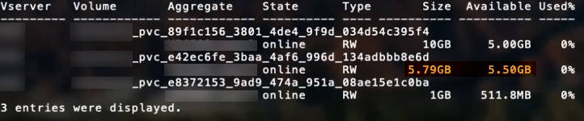

= Opciones y ejemplos de configuración DE SAN ONTAP
:hardbreaks:
:allow-uri-read: 
:icons: font
:imagesdir: ../media/

[role="lead"]
Crea y usa los controladores SAN de ONTAP con tu instalación de Trident. Esta sección ofrece ejemplos de configuración de backend y detalles para mapear backends a StorageClasses. link:https://docs.netapp.com/us-en/asa-r2/get-started/learn-about.html["Sistemas ASA r2"^] se diferencian de otros sistemas ONTAP (ASA, AFF y FAS) en la implementación de su capa de almacenamiento. Estas variaciones afectan el uso de ciertos parámetros, como se indica. link:https://docs.netapp.com/us-en/asa-r2/learn-more/hardware-comparison.html["Obtenga más información sobre las diferencias entre los sistemas ASA r2 y otros sistemas ONTAP"^]. En la configuración del backend de Trident, no necesitas especificar que tu sistema es ASA r2. Cuando seleccionas  `ontap-san` como  `storageDriverName`, Trident detecta automáticamente el sistema ASA r2 u otros sistemas ONTAP. Algunos parámetros de configuración del backend no aplican a los sistemas ASA r2, como se indica en la tabla a continuación.

NOTE: Solo el `ontap-san` El controlador (con protocolos iSCSI, NVMe/TCP y FC) es compatible con los sistemas ASA r2.

[[backend-configuration-options]]
== Opciones de configuración del back-end

A partir de la versión 26.06, puedes activar la asignación equilibrada de ONTAP para que ONTAP seleccione el agregado para los nuevos volúmenes. Consulta link:ontap-balanced-placement.html["Utiliza la distribución equilibrada con los backends de ONTAP"] para conocer los requisitos y ver ejemplos.

Consulte la siguiente tabla para ver las opciones de configuración del back-end:

[cols="1,3,2"]
|===
| Parámetro | Descripción | Predeterminado 

| `version` |  | Siempre 1 

| `storageDriverName` | Nombre del controlador de almacenamiento. No se puede modificar después de la creación. Para actualizar este parámetro, debes crear un nuevo backend. | `ontap-san` o. `ontap-san-economy` 

| `backendName` | Nombre personalizado o el back-end de almacenamiento | Nombre de controlador + «_» + LIF de datos 

| `managementLIF`  a| 
La dirección IP de un clúster o una LIF de gestión de SVM.

Se puede especificar un nombre de dominio completo (FQDN).

Se puede configurar para utilizar direcciones IPv6 si Trident se instaló con el indicador IPv6. Las direcciones IPv6 deben definirse entre corchetes, `[28e8:d9fb:a825:b7bf:69a8:d02f:9e7b:3555]` como .

Para una conmutación de sitios MetroCluster fluida, consulte <<mcc-best>>.

NOTE: Si utiliza las credenciales «vsadmin», `managementLIF` debe ser la de la SVM; si utiliza credenciales «admin», `managementLIF` debe ser la del clúster.
| «10,0.0,1», «[2001:1234:abcd::fefe]» 

| `dataLIF` | Dirección IP de LIF de protocolo. Se puede configurar para utilizar direcciones IPv6 si Trident se instaló con el indicador IPv6. Las direcciones IPv6 deben definirse entre corchetes, `[28e8:d9fb:a825:b7bf:69a8:d02f:9e7b:3555]` como . *No especifique para iSCSI.* Trident utiliza link:https://docs.netapp.com/us-en/ontap/san-admin/selective-lun-map-concept.html["Asignación de LUN selectiva de ONTAP"^] para detectar las LIF iSCSI necesarias para establecer una sesión de rutas múltiples. Se genera una advertencia si `dataLIF` se define explícitamente. *Omitir para MetroCluster.* Consulte la <<mcc-best>>. | Derivado del SVM 

| `svm` | Máquina virtual de almacenamiento que usar

*Omitir para MetroCluster.* Ver <<mcc-best>>. | Derivado si una SVM `managementLIF` está especificado 

| `useCHAP` | Use CHAP para autenticar iSCSI para los controladores SAN de ONTAP [Boolean]. Establezca como `true` para que Trident configure y utilice CHAP bidireccional como la autenticación predeterminada para la SVM especificada en el back-end. Consulte link:ontap-san-prep.html["Prepárese para configurar el back-end con los controladores SAN de ONTAP"] para obtener más información. *No compatible con FCP o NVMe/TCP.* | `false` 

| `chapInitiatorSecret` | Secreto CHAP del iniciador. Obligatorio si `useCHAP=true` | "" 

| `labels` | Conjunto de etiquetas con formato JSON arbitrario que se aplica en los volúmenes | "" 

| `chapTargetInitiatorSecret` | Secreto CHAP del iniciador de destino. Obligatorio si `useCHAP=true` | "" 

| `chapUsername` | Nombre de usuario entrante. Obligatorio si `useCHAP=true` | "" 

| `chapTargetUsername` | Nombre de usuario de destino. Obligatorio si `useCHAP=true` | "" 

| `clientCertificate` | Valor codificado en base64 del certificado de cliente. Se utiliza para autenticación basada en certificados | "" 

| `clientPrivateKey` | Valor codificado en base64 de la clave privada de cliente. Se utiliza para autenticación basada en certificados | "" 

| `trustedCACertificate` | Valor codificado en base64 del certificado de CA de confianza. Opcional. Se utiliza para autenticación basada en certificados. | "" 

| `username` | Nombre de usuario necesario para comunicarse con el clúster ONTAP . Se utiliza para la autenticación basada en credenciales. Para la autenticación de Active Directory, consulte link:../trident-use/ontap-san-examples.html#authenticate-trident-to-a-backend-svm-using-active-directory-credentials["Autenticar Trident en un SVM backend mediante credenciales de Active Directory"]. | "" 

| `password` | Contraseña necesaria para comunicarse con el clúster ONTAP . Se utiliza para la autenticación basada en credenciales. Para la autenticación de Active Directory, consulte link:../trident-use/ontap-san-examples.html#authenticate-trident-to-a-backend-svm-using-active-directory-credentials["Autenticar Trident en un SVM backend mediante credenciales de Active Directory"]. | "" 

| `svm` | Máquina virtual de almacenamiento que usar | Derivado si una SVM `managementLIF` está especificado 

| `storagePrefix` | Prefijo que se utiliza al aprovisionar nuevos volúmenes en el SVM. No se puede modificar posteriormente. Para actualizar este parámetro, necesitas crear un nuevo backend. | `trident` 

| `aggregate`  a| 
Agregado para el aprovisionamiento (opcional; si se configura, debe asignarse al SVM). Para el `ontap-nas-flexgroup` driver, esta opción se ignora. Si no se asigna, se puede utilizar cualquiera de los agregados disponibles para aprovisionar un volumen FlexGroup.

NOTE: Cuando se actualiza el agregado en SVM, se actualiza automáticamente en Trident mediante la consulta a SVM sin necesidad de reiniciar el controlador de Trident. Cuando has configurado un agregado específico en Trident para aprovisionar volúmenes, si el agregado se renombra o se traslada fuera del SVM, el backend pasa al estado de fallo en Trident mientras consulta el agregado de SVM. Debes cambiar el agregado por uno que esté presente en el SVM o eliminarlo por completo para que el backend vuelva a estar en línea.

*No especificar para sistemas ASA r2*.

*No especifiques cuándo  `useBalancedPlacement` está configurado como  `true`.*
 a| 
""

| `useBalancedPlacement`  a| 
Delegar la selección de agregados para nuevos volúmenes a ONTAP [booleano]. Requiere ONTAP 9.19.1 o posterior y  `useREST` configurado en  `true`. No se puede combinar con  `aggregate`.

Consulta link:ontap-balanced-placement.html["Utiliza la distribución equilibrada con los backends de ONTAP"] para conocer los requisitos y ver ejemplos.
| `false` 

| `limitAggregateUsage` | Error al aprovisionar si el uso supera este porcentaje. Si estás usando un backend de Amazon FSx for NetApp ONTAP, no especifiques  `limitAggregateUsage`. El proporcionado `fsxadmin` y `vsadmin` no contiene los permisos necesarios para recuperar el uso de agregados y limitarlo mediante Trident. *No especificar para sistemas ASA r2*. | "" (no se aplica de forma predeterminada) 

| `limitVolumeSize` | Error en el aprovisionamiento si el tamaño del volumen solicitado es superior a este valor. Además, restringe el tamaño máximo de los volúmenes que gestiona para las LUN. | '' (no se aplica por defecto) 

| `lunsPerFlexvol` | El número máximo de LUN por FlexVol debe estar comprendido entre [50 y 200] | `100` 

| `debugTraceFlags` | Indicadores de depuración que se deben usar para la solución de problemas. Ejemplo, {«api»:false, «method»:true}

No lo utilice a menos que esté solucionando problemas y necesite un volcado de log detallado. | `null` 

| `useREST`  a| 
Parámetro booleano para utilizar las API REST de ONTAP .

 `useREST`Cuando se establece en `true` Trident utiliza las API REST de ONTAP para comunicarse con el backend; cuando se configura en `false` Trident utiliza llamadas ONTAPI (ZAPI) para comunicarse con el backend.  Esta función requiere ONTAP 9.11.1 y versiones posteriores.  Además, el rol de inicio de sesión de ONTAP utilizado debe tener acceso a `ontapi` solicitud.  Esto se satisface mediante lo predefinido `vsadmin` y `cluster-admin` roles.  A partir de la versión Trident 24.06 y ONTAP 9.15.1 o posterior, `useREST` está configurado para `true` por defecto; cambiar `useREST` a `false` para utilizar llamadas ONTAPI (ZAPI).

`useREST`está totalmente calificado para NVMe/TCP.

NOTE: NVMe solo es compatible con las API REST de ONTAP y no con ONTAPI (ZAPI).

*Si se especifica, configúrelo siempre en `true` para sistemas ASA r2*.
| `true` Para ONTAP 9.15.1 o posterior, de lo contrario `false`. 

 a| 
`sanType`
| Utilice para seleccionar `iscsi` para iSCSI, `nvme` para NVMe/TCP o `fcp` para SCSI over Fibre Channel (FC). | `iscsi` si está en blanco 

| `formatOptions`  a| 
Utiliza `formatOptions` para especificar argumentos de línea de comandos para el comando `mkfs`, que se aplica cada vez que se formatea un volumen. Esto te permite formatear el volumen según tus preferencias. Asegúrate de especificar formatOptions de forma similar a las opciones del comando mkfs, excluyendo la ruta del dispositivo. Ejemplo: "-E nodiscard"

*Compatible con  `ontap-san` y  `ontap-san-economy` Controladores con protocolo iSCSI.* *Además, compatible con sistemas ASA r2 cuando se utilizan los protocolos iSCSI y NVMe/TCP.*
 a| 

| `limitVolumePoolSize` | Tamaño máximo de FlexVol solicitable al usar LUN en back-end económico de ONTAP-san. | "" (no se aplica de forma predeterminada) 

| `denyNewVolumePools` | Restringe `ontap-san-economy` los back-ends para que no creen nuevos volúmenes de FlexVol para contener sus LUN. Solo se utilizan los FlexVols preexistentes para aprovisionar nuevos VP. |  
|===

[[recommendations-for-using-formatoptions]]
=== Recomendaciones para utilizar formatOptions

Trident recomienda las siguientes opciones para agilizar el proceso de formateo:

* *-E nodiscard (ext3, ext4):* No intente descartar bloques en el momento de mkfs (descartar bloques inicialmente es útil en dispositivos de estado sólido y almacenamiento disperso/de aprovisionamiento ligero). Esto reemplaza la opción obsoleta "-K" y es aplicable a los sistemas de archivos ext3 y ext4.
* *-K (xfs):* No intente descartar bloques en el momento de mkfs. Esta opción es aplicable al sistema de archivos xfs.

[[authenticate-trident-to-a-backend-svm-using-active-directory-credentials]]
=== Autenticar Trident en un SVM backend mediante credenciales de Active Directory

Puede configurar Trident para autenticarse en un SVM de backend usando credenciales de Active Directory (AD). Antes de que una cuenta de AD pueda acceder a la SVM, debe configurar el acceso del controlador de dominio de AD al clúster o SVM. Para la administración de un clúster con una cuenta de AD, debe crear un túnel de dominio. Referirse a link:https://docs.netapp.com/us-en/ontap/authentication/enable-ad-users-groups-access-cluster-svm-task.html["Configurar el acceso al controlador de dominio de Active Directory en ONTAP"^] Para más detalles.

.pasos
. Configurar los ajustes del Sistema de nombres de dominio (DNS) para un SVM de backend:
+
`vserver services dns create -vserver <svm_name> -dns-servers <dns_server_ip1>,<dns_server_ip2>`

. Ejecute el siguiente comando para crear una cuenta de computadora para la SVM en Active Directory:
+
`vserver active-directory create -vserver DataSVM -account-name ADSERVER1 -domain demo.netapp.com`

. Utilice este comando para crear un usuario o grupo de AD para administrar el clúster o SVM
+
`security login create -vserver <svm_name> -user-or-group-name <ad_user_or_group> -application <application> -authentication-method domain -role vsadmin`

. En el archivo de configuración del backend de Trident , configure el `username` y `password` parámetros al nombre de usuario o grupo de AD y la contraseña, respectivamente.

[[backend-configuration-options-for-provisioning-volumes]]
== Opciones de configuración de back-end para el aprovisionamiento de volúmenes

Puede controlar el aprovisionamiento predeterminado utilizando estas opciones en la `defaults` sección de la configuración. Para ver un ejemplo, vea los ejemplos de configuración siguientes.

[cols="1,3,2"]
|===
| Parámetro | Descripción | Predeterminado 

| `spaceAllocation` | Asignación de espacio para las LUN | "verdadero" *Si se especifica, configúrelo en  `true` para sistemas ASA r2*. 

| `spaceReserve` | Modo de reserva de espacio; «ninguno» (fino) o «volumen» (grueso). *Empezar a  `none` para sistemas ASA r2*. | ninguno 

| `snapshotPolicy` | Política de Snapshot para utilizar. *Empezar a  `none` para sistemas ASA r2*. | ninguno 

| `qosPolicy` | Grupo de políticas de calidad de servicio que se asignará a los volúmenes creados. Elija uno de qosPolicy o adaptiveQosPolicy por pool/back-end de almacenamiento. Usar grupos de políticas de QoS con Trident requiere ONTAP 9 Intersight 8 o posterior. Debe usar un grupo de políticas de calidad de servicio no compartido y asegurarse de que el grupo de políticas se aplique a cada componente individualmente. Un grupo de políticas de calidad de servicio compartido aplica el techo máximo para el rendimiento total de todas las cargas de trabajo. | "" 

| `adaptiveQosPolicy` | Grupo de políticas de calidad de servicio adaptativo que permite asignar los volúmenes creados. Elija uno de qosPolicy o adaptiveQosPolicy por pool/back-end de almacenamiento | "" 

| `snapshotReserve` | Porcentaje de volumen reservado para snapshots. *No especificar para sistemas ASA r2*. | «0» si `snapshotPolicy` no es “ninguno”, de lo contrario” 

| `splitOnClone` | Divida un clon de su elemento principal al crearlo | "falso" 

| `encryption` | Activa NetApp Volume Encryption (NVE) en el nuevo volumen; el valor predeterminado es  `false`. NVE debe estar licenciado y habilitado en el clúster para usar esta opción. Si NAE está habilitado en el backend, cualquier volumen aprovisionado en Trident tendrá NAE habilitado. Para más información, consulta: link:../trident-reco/security-reco.html["Cómo funciona Trident con NVE y NAE"]. | "falso" *Si se especifica, configúrelo en  `true` para sistemas ASA r2*. 

| `luksEncryption` | Active el cifrado LUKS. Consulte link:../trident-reco/security-luks.html["Usar la configuración de clave unificada de Linux (LUKS)"]. | "" *Establecer en  `false` para sistemas ASA r2*. 

| `tieringPolicy` | Política de niveles para utilizar "ninguno" *No especificar para sistemas ASA r2*. |  

| `nameTemplate` | Plantilla para crear nombres de volúmenes personalizados. | "" 
|===

[[volume-provisioning-examples]]
=== Ejemplos de aprovisionamiento de volúmenes

Aquí hay un ejemplo con los valores predeterminados definidos:

[source, yaml]
----
---
version: 1
storageDriverName: ontap-san
managementLIF: 10.0.0.1
svm: trident_svm
username: admin
password: <password>
labels:
  k8scluster: dev2
  backend: dev2-sanbackend
storagePrefix: alternate-trident
debugTraceFlags:
  api: false
  method: true
defaults:
  spaceReserve: volume
  qosPolicy: standard
  spaceAllocation: 'false'
  snapshotPolicy: default
  snapshotReserve: '10'

----

NOTE: Para todos los volúmenes creados usando el `ontap-san` driver, Trident añade un 10 % extra de capacidad a la FlexVol para acomodar los metadatos del LUN. El LUN se aprovisiona con el tamaño exacto que el usuario solicita en el PVC. Trident añade un 10 % a la FlexVol (se muestra como tamaño disponible en ONTAP). Ahora los usuarios obtienen la cantidad de capacidad utilizable que solicitaron. Este cambio también evita que los LUN se vuelvan de solo lectura a menos que se utilice por completo el espacio disponible. Esto no se aplica a ontap-san-economy.

Para los back-ends que definen `snapshotReserve`, Trident calcula el tamaño de los volúmenes de la siguiente manera:

[listing]
----
Total volume size = [(PVC requested size) / (1 - (snapshotReserve percentage) / 100)] * 1.1
----
El 1.1 es el 10 por ciento adicional que Trident agrega al FlexVol para acomodar los metadatos del LUN. Para  `snapshotReserve` = 5%, y la solicitud de PVC = 5 GiB, el tamaño total del volumen es 5,79 GiB y el tamaño disponible es 5,5 GiB. El  `volume show` El comando debería mostrar resultados similares a este ejemplo:

En la actualidad, el cambio de tamaño es la única manera de utilizar el nuevo cálculo para un volumen existente.

[[minimal-configuration-examples]]
== Ejemplos de configuración mínima

Los ejemplos siguientes muestran configuraciones básicas que dejan la mayoría de los parámetros en los valores predeterminados. Esta es la forma más sencilla de definir un back-end.

NOTE: Si usa Amazon FSx en NetApp ONTAP con Trident, NetApp le recomienda que especifique nombres de DNS para las LIF en lugar de direcciones IP.

.Ejemplo de SAN ONTAP
[%collapsible]
====
Se trata de una configuración básica que utiliza el `ontap-san` controlador.

[source, yaml]
----
---
version: 1
storageDriverName: ontap-san
managementLIF: 10.0.0.1
svm: svm_iscsi
labels:
  k8scluster: test-cluster-1
  backend: testcluster1-sanbackend
username: vsadmin
password: <password>
----
====
.Ejemplo de MetroCluster
[#mcc-best%collapsible]
====
Puede configurar el backend para evitar tener que actualizar manualmente la definición de backend después del switchover y el switchover durante link:../trident-reco/backup.html#svm-replication-and-recovery["Replicación y recuperación de SVM"].

Para una conmutación de sitios y una conmutación de estado sin problemas, especifique la SVM con `managementLIF` y omita `svm` los parámetros. Por ejemplo:

[source, yaml]
----
version: 1
storageDriverName: ontap-san
managementLIF: 192.168.1.66
username: vsadmin
password: password
----
====
.Ejemplo de economía de SAN ONTAP
[%collapsible]
====
[source, yaml]
----
version: 1
storageDriverName: ontap-san-economy
managementLIF: 10.0.0.1
svm: svm_iscsi_eco
username: vsadmin
password: <password>
----
====
.Ejemplo de autenticación basada en certificados
[%collapsible]
====
En este ejemplo de configuración básica `clientCertificate`, `clientPrivateKey`, y. `trustedCACertificate` (Opcional, si se utiliza una CA de confianza) se completan en `backend.json` Y tome los valores codificados base64 del certificado de cliente, la clave privada y el certificado de CA de confianza, respectivamente.

[source, yaml]
----
---
version: 1
storageDriverName: ontap-san
backendName: DefaultSANBackend
managementLIF: 10.0.0.1
svm: svm_iscsi
useCHAP: true
chapInitiatorSecret: cl9qxIm36DKyawxy
chapTargetInitiatorSecret: rqxigXgkesIpwxyz
chapTargetUsername: iJF4heBRT0TCwxyz
chapUsername: uh2aNCLSd6cNwxyz
clientCertificate: ZXR0ZXJwYXB...ICMgJ3BhcGVyc2
clientPrivateKey: vciwKIyAgZG...0cnksIGRlc2NyaX
trustedCACertificate: zcyBbaG...b3Igb3duIGNsYXNz
----
====
.Ejemplos de CHAP bidireccional
[%collapsible]
====
Estos ejemplos crean un backend con `useCHAP` establezca en `true`.

.Ejemplo de CHAP de SAN de ONTAP
[source, yaml]
----
---
version: 1
storageDriverName: ontap-san
managementLIF: 10.0.0.1
svm: svm_iscsi
labels:
  k8scluster: test-cluster-1
  backend: testcluster1-sanbackend
useCHAP: true
chapInitiatorSecret: cl9qxIm36DKyawxy
chapTargetInitiatorSecret: rqxigXgkesIpwxyz
chapTargetUsername: iJF4heBRT0TCwxyz
chapUsername: uh2aNCLSd6cNwxyz
username: vsadmin
password: <password>
----
.Ejemplo de CHAP de economía de SAN ONTAP
[source, yaml]
----
---
version: 1
storageDriverName: ontap-san-economy
managementLIF: 10.0.0.1
svm: svm_iscsi_eco
useCHAP: true
chapInitiatorSecret: cl9qxIm36DKyawxy
chapTargetInitiatorSecret: rqxigXgkesIpwxyz
chapTargetUsername: iJF4heBRT0TCwxyz
chapUsername: uh2aNCLSd6cNwxyz
username: vsadmin
password: <password>
----
====
.Ejemplo de distribución equilibrada
[%collapsible]
====
Este ejemplo habilita la distribución equilibrada de ONTAP para que ONTAP seleccione el agregado para los nuevos volúmenes. La distribución equilibrada requiere ONTAP 9.19.1 o una versión posterior. Consulta link:ontap-balanced-placement.html["Utiliza la distribución equilibrada con los backends de ONTAP"] para obtener más información.

[source, yaml]
----
---
version: 1
storageDriverName: ontap-san
backendName: san-balanced-placement
managementLIF: 10.0.0.1
svm: svm_iscsi
username: vsadmin
password: <password>
useBalancedPlacement: true
----
====
.Ejemplo de NVMe/TCP
[%collapsible]
====
Debe tener una SVM configurada con NVMe en el back-end de ONTAP. Esta es una configuración de back-end básica para NVMe/TCP.

[source, yaml]
----
---
version: 1
backendName: NVMeBackend
storageDriverName: ontap-san
managementLIF: 10.0.0.1
svm: svm_nvme
username: vsadmin
password: password
sanType: nvme
useREST: true
----
====
.Ejemplo de SCSI sobre FC (FCP)
[%collapsible]
====
Debe tener una SVM configurada con FC en el back-end de ONTAP. Esta es una configuración de back-end básica para FC.

[source, yaml]
----
---
version: 1
backendName: fcp-backend
storageDriverName: ontap-san
managementLIF: 10.0.0.1
svm: svm_fc
username: vsadmin
password: password
sanType: fcp
useREST: true
----
====
.Ejemplo de configuración de backend con nameTemplate
[%collapsible]
====
[source, yaml]
----
---
version: 1
storageDriverName: ontap-san
backendName: ontap-san-backend
managementLIF: <ip address>
svm: svm0
username: <admin>
password: <password>
defaults:
  nameTemplate: "{{.volume.Name}}_{{.labels.cluster}}_{{.volume.Namespace}}_{{.vo\
    lume.RequestName}}"
labels:
  cluster: ClusterA
  PVC: "{{.volume.Namespace}}_{{.volume.RequestName}}"
----
====
.Ejemplo de formatOptions para el controlador ONTAP-san-economy
[%collapsible]
====
[source, yaml]
----
---
version: 1
storageDriverName: ontap-san-economy
managementLIF: ""
svm: svm1
username: ""
password: "!"
storagePrefix: whelk_
debugTraceFlags:
  method: true
  api: true
defaults:
  formatOptions: -E nodiscard
----
====

[[examples-of-backends-with-virtual-pools]]
== Ejemplos de back-ends con pools virtuales

En estos archivos de definición de backend de ejemplo, se establecen valores predeterminados específicos para todos los pools de almacenamiento, como `spaceReserve` en ninguno, `spaceAllocation` en falso, y. `encryption` en falso. Los pools virtuales se definen en la sección de almacenamiento.

Trident establece las etiquetas de aprovisionamiento en el campo de comentarios. En las copias FlexVol volume Trident se establecen comentarios Todas las etiquetas presentes en un pool virtual para el volumen de almacenamiento durante el aprovisionamiento. Para mayor comodidad, los administradores de almacenamiento pueden definir etiquetas por pool virtual y agrupar volúmenes por etiqueta.

En estos ejemplos, algunos de los pools de almacenamiento establecen sus propios `spaceReserve`, `spaceAllocation`, y. `encryption` y algunos pools sustituyen los valores predeterminados.

.Ejemplo de SAN ONTAP
[%collapsible]
====
[source, yaml]
----
---
version: 1
storageDriverName: ontap-san
managementLIF: 10.0.0.1
svm: svm_iscsi
useCHAP: true
chapInitiatorSecret: cl9qxIm36DKyawxy
chapTargetInitiatorSecret: rqxigXgkesIpwxyz
chapTargetUsername: iJF4heBRT0TCwxyz
chapUsername: uh2aNCLSd6cNwxyz
username: vsadmin
password: <password>
defaults:
  spaceAllocation: "false"
  encryption: "false"
  qosPolicy: standard
labels:
  store: san_store
  kubernetes-cluster: prod-cluster-1
region: us_east_1
storage:
  - labels:
      protection: gold
      creditpoints: "40000"
    zone: us_east_1a
    defaults:
      spaceAllocation: "true"
      encryption: "true"
      adaptiveQosPolicy: adaptive-extreme
  - labels:
      protection: silver
      creditpoints: "20000"
    zone: us_east_1b
    defaults:
      spaceAllocation: "false"
      encryption: "true"
      qosPolicy: premium
  - labels:
      protection: bronze
      creditpoints: "5000"
    zone: us_east_1c
    defaults:
      spaceAllocation: "true"
      encryption: "false"

----
====
.Ejemplo de economía de SAN ONTAP
[%collapsible]
====
[source, yaml]
----
---
version: 1
storageDriverName: ontap-san-economy
managementLIF: 10.0.0.1
svm: svm_iscsi_eco
useCHAP: true
chapInitiatorSecret: cl9qxIm36DKyawxy
chapTargetInitiatorSecret: rqxigXgkesIpwxyz
chapTargetUsername: iJF4heBRT0TCwxyz
chapUsername: uh2aNCLSd6cNwxyz
username: vsadmin
password: <password>
defaults:
  spaceAllocation: "false"
  encryption: "false"
labels:
  store: san_economy_store
region: us_east_1
storage:
  - labels:
      app: oracledb
      cost: "30"
    zone: us_east_1a
    defaults:
      spaceAllocation: "true"
      encryption: "true"
  - labels:
      app: postgresdb
      cost: "20"
    zone: us_east_1b
    defaults:
      spaceAllocation: "false"
      encryption: "true"
  - labels:
      app: mysqldb
      cost: "10"
    zone: us_east_1c
    defaults:
      spaceAllocation: "true"
      encryption: "false"
  - labels:
      department: legal
      creditpoints: "5000"
    zone: us_east_1c
    defaults:
      spaceAllocation: "true"
      encryption: "false"

----
====
.Ejemplo de NVMe/TCP
[%collapsible]
====
[source, yaml]
----
---
version: 1
storageDriverName: ontap-san
sanType: nvme
managementLIF: 10.0.0.1
svm: nvme_svm
username: vsadmin
password: <password>
useREST: true
defaults:
  spaceAllocation: "false"
  encryption: "true"
storage:
  - labels:
      app: testApp
      cost: "20"
    defaults:
      spaceAllocation: "false"
      encryption: "false"

----
====

[[map-backends-to-storageclasses]]
== Asigne los back-ends a StorageClass

Las siguientes definiciones de StorageClass hacen referencia a <<Ejemplos de back-ends con pools virtuales>>. Usando el campo  `parameters.selector`, cada StorageClass indica qué grupos virtuales se pueden usar para alojar un volumen. El volumen ahora tiene los aspectos definidos en el grupo virtual elegido.

* El  `protection-gold` StorageClass se asigna al primer grupo virtual en el  `ontap-san` backend. Este es el único grupo que ofrece protección de nivel gold.
+
[source, yaml]
----
apiVersion: storage.k8s.io/v1
kind: StorageClass
metadata:
  name: protection-gold
provisioner: csi.trident.netapp.io
parameters:
  selector: "protection=gold"
  fsType: "ext4"
----
* El  `protection-not-gold` StorageClass se asigna al segundo y tercer grupo virtual en  `ontap-san` backend. Estos son los únicos grupos que ofrecen un nivel de protección distinto a gold.
+
[source, yaml]
----
apiVersion: storage.k8s.io/v1
kind: StorageClass
metadata:
  name: protection-not-gold
provisioner: csi.trident.netapp.io
parameters:
  selector: "protection!=gold"
  fsType: "ext4"
----
* El  `app-mysqldb` StorageClass se asigna al tercer grupo virtual en  `ontap-san-economy` backend. Este es el único grupo que ofrece configuración de grupo de almacenamiento para la app tipo mysqldb.
+
[source, yaml]
----
apiVersion: storage.k8s.io/v1
kind: StorageClass
metadata:
  name: app-mysqldb
provisioner: csi.trident.netapp.io
parameters:
  selector: "app=mysqldb"
  fsType: "ext4"
----
* El  `protection-silver-creditpoints-20k` StorageClass se asigna al segundo grupo virtual en  `ontap-san` backend. Este es el único grupo que ofrece protección de nivel silver y 20 000 puntos de crédito.
+
[source, yaml]
----
apiVersion: storage.k8s.io/v1
kind: StorageClass
metadata:
  name: protection-silver-creditpoints-20k
provisioner: csi.trident.netapp.io
parameters:
  selector: "protection=silver; creditpoints=20000"
  fsType: "ext4"
----
* El  `creditpoints-5k` StorageClass se asigna al tercer grupo virtual en el backend `ontap-san` y al cuarto grupo virtual en el backend `ontap-san-economy`. Estas son las únicas ofertas de grupos con 5000 puntos de crédito.
+
[source, yaml]
----
apiVersion: storage.k8s.io/v1
kind: StorageClass
metadata:
  name: creditpoints-5k
provisioner: csi.trident.netapp.io
parameters:
  selector: "creditpoints=5000"
  fsType: "ext4"
----
* El `my-test-app-sc` StorageClass se asigna al grupo virtual `testAPP` en el controlador `ontap-san` con `sanType: nvme`. Este es el único grupo que ofrece `testApp`.
+
[source, yaml]
----
---
apiVersion: storage.k8s.io/v1
kind: StorageClass
metadata:
  name: my-test-app-sc
provisioner: csi.trident.netapp.io
parameters:
  selector: "app=testApp"
  fsType: "ext4"
----

Trident decide qué grupo virtual se selecciona y garantiza que se cumpla el requisito de almacenamiento.
