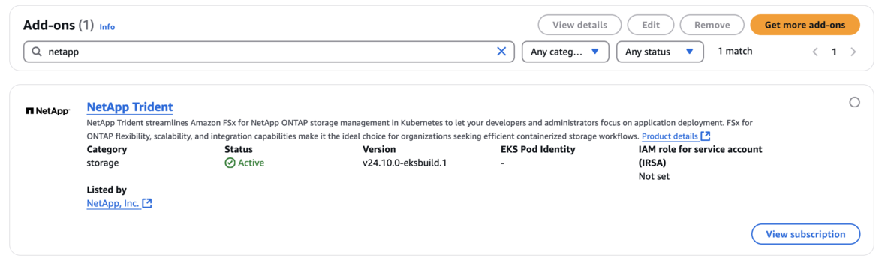

= Configure el complemento Trident EKS en un clúster EKS
:hardbreaks:
:allow-uri-read: 
:icons: font
:imagesdir: ../media/

[role="lead"]
NetApp Trident optimiza la gestión del almacenamiento de Amazon FSx para NetApp ONTAP en Kubernetes para que sus desarrolladores y administradores se centren en la puesta en marcha de aplicaciones. El complemento NetApp Trident EKS incluye los parches de seguridad más recientes, correcciones de errores y está validado por AWS para funcionar con Amazon EKS. El complemento EKS le permite garantizar de forma constante que sus clústeres de Amazon EKS sean seguros y estables y reducir la cantidad de trabajo que necesita para instalar, configurar y actualizar complementos.

== Requisitos previos

Asegúrese de tener lo siguiente antes de configurar el complemento Trident para AWS EKS:

* Una cuenta de clúster de Amazon EKS con permisos para trabajar con complementos. Consulte link:https://docs.aws.amazon.com/eks/latest/userguide/eks-add-ons.html["Complementos de Amazon EKS"^].
* Permisos de AWS para AWS Marketplace:
`"aws-marketplace:ViewSubscriptions",
"aws-marketplace:Subscribe",
"aws-marketplace:Unsubscribe`
* Tipo de AMI: Amazon Linux 2 (AL2_x86_64) o Amazon Linux 2 Arm (AL2_ARM_64)
* Tipo de nodo: AMD o ARM
* Un sistema de archivos Amazon FSx para NetApp ONTAP existente

== Pasos

. Asegúrese de crear el rol de IAM y el secreto de AWS para permitir que los pods de EKS accedan a los recursos de AWS. Para obtener instrucciones, consulte link:../trident-use/trident-fsx-iam-role.html["Cree un rol de IAM y AWS Secret"^].
. En tu clúster de Kubernetes de EKS, navega a la pestaña *Add-ons*.
+
image::../media/aws-eks-01.png[aws llega a 01]

. Vaya a *AWS Marketplace add-ons* y elija la categoría _storage_.
+
image::../media/aws-eks-02.png[aws llega a 02]

. Localice *NetApp Trident* y seleccione la casilla de verificación para el complemento Trident, y haga clic en *Siguiente*.
. Elija la versión deseada del complemento.
+
image::../media/aws-eks-03.png[aws llega a 03]

. Seleccione la opción Rol IAM que desea heredar del nodo.
+
image::../media/aws-eks-04.png[aws llega a 04]

. Configure cualquier configuración opcional según sea necesario y seleccione *Siguiente*.
+
Siga el esquema de configuración del complemento * y establezca el parámetro Valores de configuración en la sección Valores de configuración * en el arn de rol que creó en el paso anterior (Paso 1) (el valor debe tener el siguiente formato `eks.amazonaws.com/role-arn: arn:aws:iam::464262061435:role/AmazonEKS_FSXN_CSI_DriverRole`: ). NOTA: Si selecciona Anular para el método de resolución de conflictos, una o más de las configuraciones del complemento existente se pueden sobrescribir con la configuración del complemento Amazon EKS. Si no habilita esta opción y existe un conflicto con la configuración existente, se producirá un error en la operación. Puede utilizar el mensaje de error resultante para solucionar el conflicto. Antes de seleccionar esta opción, asegúrese de que el complemento de Amazon EKS no gestiona la configuración que necesita para autogestionar.

+
image::../media/aws-eks-06.png[aws llega a 06]

+
** A partir de la versión 25,02, Trident admite la configuración de back-end automática. Trident crea las clases de almacenamiento y back-end sin problemas tras la instalación de Trident. Para activar la configuración de backend automática, agregue el `ontapConfigurator` parámetro y especifique `authType`, `fsxnID` y `protocols` en el esquema de configuración del complemento junto con `cloudIdentity` durante la instalación.
+
[listing]
----
"ontapConfigurator": {
        "enabled": true,
        "svms": [
          {
            "authType": "awsarn",
            "fsxnID": "fs-0dfeaa884a68b1cab",
            "protocols": [
              "nfs",
              "iscsi"
            ]
          }
        ]
      }}"

----
+

NOTE: Para desactivar la configuración de backend automática, actualice la versión de Trident y establezca el *ontapConfigurator* en *false*.

. Seleccione *Crear*.
. Compruebe que el estado del complemento es _Active_.
+

. Ejecute el siguiente comando para comprobar que Trident está correctamente instalado en el clúster:
+
[listing]
----
kubectl get pods -n trident
----
. Continúe con la configuración y configure el back-end de almacenamiento. Para obtener más información, consulte link:../trident-use/trident-fsx-storage-backend.html["Configure el backend de almacenamiento"^].

== Instale/desinstale el complemento Trident EKS mediante la interfaz de línea de comandos

.Instale el complemento NetApp Trident EKS mediante la interfaz de línea de comandos:
El siguiente comando de ejemplo instala el complemento Trident EKS:
`eksctl create addon --cluster clusterName --name netapp_trident-operator --version v24.10.0-eksbuild.1` (Con una versión dedicada)

.Desinstale el complemento NetApp Trident EKS mediante la interfaz de línea de comandos:
El siguiente comando desinstala el complemento Trident EKS:

[listing]
----
eksctl delete addon --cluster K8s-arm --name netapp_trident-operator
----